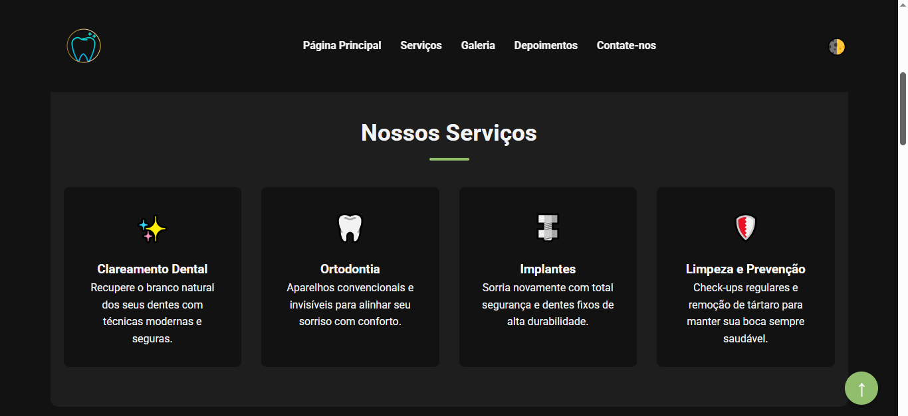

# Projeto  Sorriso Perfeito

## Objetivo
Este projeto foi desenvolvido como atividade acadêmica com o objetivo de construir uma Landing Page moderna, totalmente responsiva e interativa para o consultório odontológico fictício **Sorriso Perfeito**. A prática reforça conceitos cruciais de desenvolvimento web front-end nativo.

## Tecnologias Utilizadas
- **HTML5:** Estrutura semântica das seções da página.
- **CSS3:** Estilização utilizando Flexbox, CSS Grid, variáveis de ambiente e Media Queries para responsividade.
- **JavaScript (Vanilla):** Lógica nativa de interatividade para temas, validação e manipulação do DOM.
- **Google Fonts:** Utilização da tipografia Roboto.

## Estrutura de Pastas

```

/projetoSorrisoPerfeito
│
├── index.html
├── styles/
│   └── style.css
├── scripts/
│   └── script.js
├── assets/
│   ├── img/
│   └── fonts/
└── README.md

```

## Funcionalidades Implementadas
- [x] HTML5 Semântico (`<header>`, `<main>`, `<section>`, `<footer>`).
- [x] Paleta de cores oficial sugerida aplicada de forma harmônica.
- [x] Design Responsivo para Mobile, Tablet e Desktop.
- [x] Alternador de **Modo Claro / Modo Escuro (Dark Mode)** persistido através do **Local Storage**.
- [x] Validação lógica e sanitização de dados no formulário de contato.
- [x] **[Desafio Extra]** Animações de Scroll com CSS (`fade-in` e subida suave nas seções).
- [x] **[Desafio Extra]** Botão dinâmico "Voltar ao Topo".

## Imagens Exemplares do Site



## Como Executar o Projeto
1. Faça o clone deste repositório ou baixe os arquivos.
2. Abra a pasta raiz `/projetoSorrisoPerfeito`.
3. Dê um duplo clique no arquivo `index.html` para executá-lo diretamente no navegador de sua preferência (ou utilize extensões como a *Live Server* no VS Code).

## Autor
- **Nome do Aluno:** Maicon Ferreira Machado
- **Turma/Curso:** Téc. Informática - Módulo 3

---
